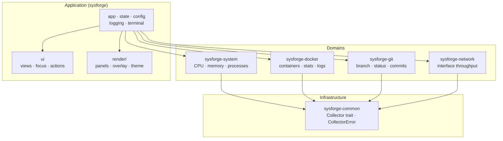
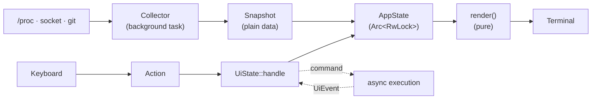

[](https://github.com/picoliW/sysforge/actions/workflows/ci.yml)

# SysForge

A terminal dashboard that brings your development environment into a single
screen: CPU, memory, processes, Docker containers, the current Git
repository, and network interfaces — each in its own full-screen view, all
updating live.

SysForge is built for Linux and WSL, in Rust, with an emphasis on clean
architecture: every domain is an independent crate, data flows in one
direction, and the terminal is treated as a rendering target for observed
state rather than a place to print to.

> _Screenshots: see the [Screenshots](#screenshots) section below._

## Quick start

Requires a stable Rust toolchain (edition 2024, Rust 1.85+).

```bash
git clone https://github.com/picoliW/sysforge.git
cd sysforge
cargo run --release
```

Press `?` at any time for the key bindings. `1`–`5` switch views, `Tab`
cycles panels within a view, `q` quits.

### Configuration

SysForge runs with sensible defaults and no configuration file. To customize,
create `~/.config/sysforge/config.toml` (XDG). Every field is optional; a
partial file overrides only what it mentions.

```toml
[ui]
frame_interval_ms = 100

[collectors.cpu]
interval_ms = 1000

[docker]
enabled = true
socket = "/var/run/docker.sock"
interval_ms = 2000

[theme]
accent = "cyan"
success = "green"
warning = "yellow"
```

Unknown keys are rejected on startup, so a typo fails loudly rather than
being silently ignored. Logs are written to `~/.local/state/sysforge/`;
set `RUST_LOG=debug` for verbose output.

## Architecture

SysForge is a Cargo workspace organized into four layers. The guiding rule:
**domain crates depend only on `common`, never on each other or on the
application.** Cross-domain communication happens through the shared trait
and types in `common`; composition happens in `app`.



### The layers

**Infrastructure — `sysforge-common`.** The contract every data source
implements: the `Collector` trait (an async producer of periodic samples)
and `CollectorError`. This is the only crate every other crate depends on.

**Domains — `sysforge-system`, `-docker`, `-git`, `-network`.** Each owns
one area of the system, reads it (via `/proc`, the Docker socket, the `git`
binary, `/proc/net/dev`), and produces a plain *snapshot* of UI-ready data.
A domain crate knows nothing about the terminal, the UI, or any other
domain. Each also owns its own configuration section.

**Application — `sysforge` (the `app` crate).** Orchestration: it starts a
task per collector, holds shared state behind a lock, runs the event loop,
translates input, and composes the views. This is the only crate that knows
every domain exists.

### Data flow

Data moves in one direction. A collector never knows who consumes its
output; the UI never knows where data came from.



Each collector runs on its own Tokio task, sampling at its configured
interval and writing its snapshot into the shared `AppState`. The render
loop reads a snapshot of that state each frame and draws it — rendering is a
pure function of state, holding no hidden UI state of its own. Keyboard input
is translated into semantic `Action`s; what an action *means* given the
current view and focus is decided in one place (`UiState::handle`), which may
emit a `Command` for asynchronous work (like fetching container logs) whose
result returns as a `UiEvent`.

### Views and panels

A **panel** is a reusable component (the CPU panel, the Docker table). A
**view** is a full screen composed of one or more panels. The Overview view
arranges every domain at a glance; each domain also has a dedicated
full-screen view. Adding a domain means adding a panel and one entry to the
view list — the UI grows by composition, not by editing existing panels.

## Design decisions

A few choices worth explaining, because they shaped everything else:

**Collectors are stateless producers.** The `Collector` trait returns a
snapshot; it never touches the UI or accumulates presentation state. This
keeps parsers pure and unit-testable without `/proc` or a daemon, and lets a
single generic runner drive every domain. Stateful collectors (CPU, network)
keep only the previous *sample* internally, to compute deltas — never UI
history.

**Offline is data, not an error.** A stopped Docker daemon, a directory that
isn't a Git repository, a missing socket — these are *observations*, modeled
as enum variants the UI renders, not errors that crash a task or spam the
log. Collectors log only state *transitions* (online → offline), never every
failed tick.

**Buy the client, build the architecture.** SysForge talks to Docker through
[bollard](https://crates.io/crates/bollard) and to Git by invoking the `git`
binary and parsing its stable `--porcelain` output, rather than
reimplementing either. The project's value is the dashboard architecture, not
a hand-rolled Docker client. Streams from these clients are encapsulated
inside their domain crate — the rest of the app only ever sees snapshots.

**Semantic theming.** Panels never name colors; they name *roles* (`accent`,
`success`, `warning`, `muted`). The theme maps roles to colors, so a single
config change restyles everything coherently, and "what does this element
mean?" is answered at the point of use.

**Configuration flows through constructors.** Nothing reads global state or
environment variables deep in the call tree. Config is parsed once, validated
at startup, and passed down — which keeps every component testable with
arbitrary settings.

## Workspace layout

| Crate | Responsibility |
|-------|----------------|
| `sysforge` (`crates/app`) | Orchestration, state, config, event loop, rendering |
| `sysforge-common` | `Collector` trait and shared error type |
| `sysforge-system` | CPU, memory and process collectors (`/proc`) |
| `sysforge-docker` | Container listing, per-container stats, logs |
| `sysforge-git` | Branch, working-tree status, recent commits |
| `sysforge-network` | Per-interface throughput (`/proc/net/dev`) |

Built on [ratatui](https://ratatui.rs) and [crossterm](https://crates.io/crates/crossterm)
for the terminal UI, [tokio](https://tokio.rs) for async, and
[tracing](https://crates.io/crates/tracing) for structured logging.

## Development

```bash
cargo test --workspace                              # run all tests
cargo clippy --workspace --all-targets -- -D warnings  # lint as CI does
cargo fmt --all                                     # format
```

CI runs formatting, clippy (warnings as errors), and the full test suite on
every push and pull request.

## Screenshots

_To be added._

## Roadmap

Domains under consideration for future versions: Kubernetes, database
connections (PostgreSQL, Redis, MongoDB, MySQL), cloud CLIs, and richer
per-domain interactions (container exec, commit diffs, log streaming).

## License

MIT